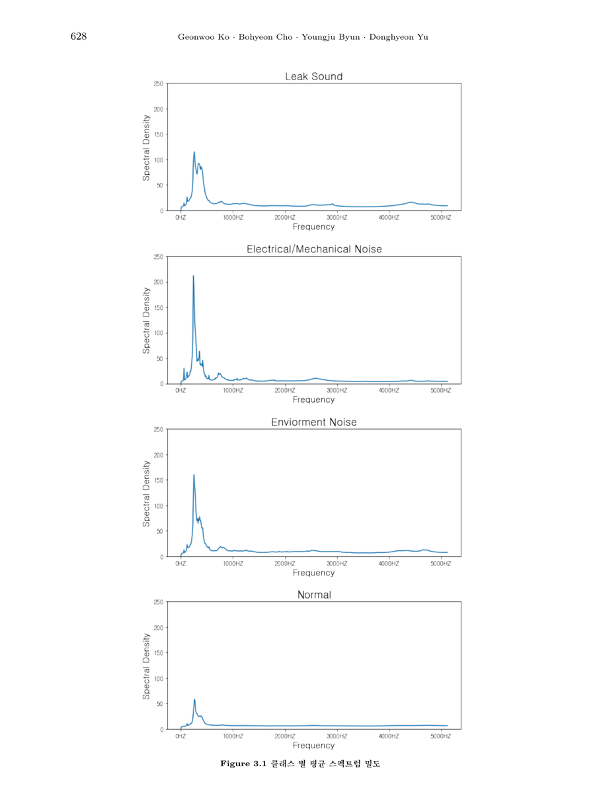
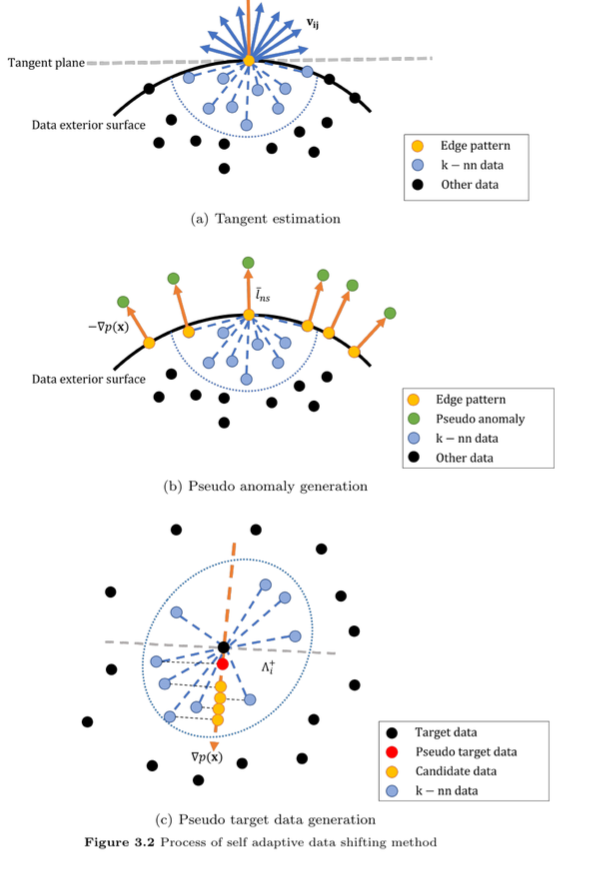

<div align="center">

# 🔍 Unsupervised Anomaly Detection for Sensor Data

**비지도 학습 기반 센서 데이터 이상치 탐지 모형 비교 연구**

정상 데이터만으로 학습하는 6가지 비지도 학습 모형을 구현하고,
실제 상수관로 누수 감지 센서 데이터에 대한 이상치 탐지 성능을 비교합니다.

[](https://www.python.org/)
[](https://pytorch.org/)
[](https://scikit-learn.org/)
[](#license)

📄 기반 논문: 고건우, 조보현, 변영주, 유동현. (2023).
[*비지도 학습 기반 센서 데이터의 이상치 탐지 비교 연구*](http://dx.doi.org/10.7465/jkdi.2023.34.4.619).
한국데이터정보과학회지, 34(4), 619–634.

</div>

---

## 📌 Overview

산업 현장의 센서 데이터는 이상치(누수, 고장 등)의 발생 빈도가 매우 낮아 **클래스 불균형**이
심하고, 라벨링 비용도 높습니다. 이 프로젝트는 **정상 데이터만으로 학습**하는 비지도 학습 기반
이상치 탐지 모형들을 하나의 파이프라인으로 구현하고, 동일한 주파수 센서 데이터셋에 대해
공정하게 성능을 비교하는 것을 목표로 합니다.

**핵심 아이디어**

- 🎯 학습에는 정상 데이터만 사용 (라벨 없이)
- 🧭 [Wang 등 (2018)](https://doi.org/10.1016/j.patcog.2017.09.014)의 **자가 적응 데이터 이동
  (Self-Adaptive Data Shifting)** 기법으로 정상 데이터의 경계(edge)를 검증용 의사 이상치
  (pseudo anomaly)로 이동시켜, 라벨 없이도 조율 모수(threshold, hyperparameter)를 선택
- ⚖️ 이상치 비율 변화(시나리오 1) / 학습 데이터 오염(시나리오 2) 두 조건에서 강건성 비교

---

## 🧠 구현 모형

| 모형 | 유형 | 핵심 아이디어 | 상태 |
|---|---|---|---|
| **[OC-SVM](src/models/one_class_svm.py)** | Machine Learning | 원점으로부터 최대 마진의 초평면(hyperplane) 학습 | ✅ 구현 완료 |
| **[SVDD](src/models/svdd.py)** | Machine Learning | 정상 데이터를 감싸는 최소 반지름의 초구(hypersphere) 학습 | ✅ 구현 완료 |
| **[Autoencoder (CAE)](src/models/autoencoder.py)** | Deep Learning | 잠재공간 압축 → 복원, 복원오차로 이상치 판별 | ✅ 구현 완료 |
| **[AnoGAN](src/models/anogan.py)** | Deep Learning | GAN으로 정상 분포 학습 후, latent 최적화로 이상치 점수 산출 | ✅ 구현 완료 |
| **[Deep SVDD](src/models/deep_svdd.py)** | Deep Learning | 신경망으로 정상 데이터를 구의 중심에 매핑 (오토인코더 사전학습으로 초기화) | ✅ 구현 완료 |
| **[DASVDD](src/models/dasvdd.py)** | Deep Learning | Autoencoder + Deep SVDD 결합, 복원오차 + SVDD 거리로 이상치 판별 | ✅ 구현 완료 |

> 🎉 논문에서 다룬 6개 모형 구현이 모두 완료되었습니다. 이후 추가되는 모형은 이 표에 이어서
> 정리합니다.

<details>
<summary><b>모형별 이상치 점수 정의 (펼치기)</b></summary>

<br>

| 모형 | 이상치 점수 |
|---|---|
| OC-SVM | $s(x) = -\,\text{sign}((\omega^*)^T\Phi(x) - \rho^*)$ (결정함수 부호 반전) |
| SVDD | $s(x) = \lVert \Phi(x) - c^* \rVert$ (초구 중점까지의 거리) |
| Autoencoder | $s(x) = \lVert x - g_\theta(h_\phi(x)) \rVert^2$ |
| AnoGAN | $s(x) = (1-\lambda) L_R(x, z_\gamma) + \lambda L_D(x, z_\gamma)$ |
| Deep SVDD | $s(x) = \lVert \Phi(x; \Omega^*) - c^* \rVert^2$ |
| DASVDD | $s(x) = \lVert x - g_{\theta^*}(h_{\phi^*}(x)) \rVert^2 + \gamma \lVert h_{\phi^*}(x) - c \rVert^2$ |

</details>

---

## 📊 데이터셋

[AI Hub — 상수관로 누수 및 파손 진단 센서 데이터](https://www.aihub.or.kr)를 사용합니다.
센서로 수집된 음향 신호를 푸리에 변환하여 얻은 **주파수 스펙트럼 밀도(0~5120Hz, 10Hz 해상도,
총 513개 컬럼)**를 입력으로 사용합니다.

| 유형 | 클래스 | 데이터 수 | 비율 |
|---|---|---:|---:|
| 누수 감지 | 누수 (이상치) | 20,000 | 40% |
| 누수 감지 | 기계·전기음 | 5,000 | 10% |
| 누수 감지 | 환경음 | 5,000 | 10% |
| 누수 미감지 | 정상음 (정상) | 20,000 | 40% |
| **총계** | | **50,000** | 100% |

> 본 연구에서는 **정상음 → 정상 데이터**, **누수 → 이상치**로 정의하고, 주파수 스펙트럼 밀도
> 컬럼만 입력 변수로 사용합니다.

<div align="center">


<sub>클래스 별 평균 스펙트럼 밀도 — 위에서부터 누수(Leak Sound), 기계·전기음
(Electrical/Mechanical Noise), 환경음(Environment Noise), 정상음(Normal). 출처: 원 논문 Figure 3.1</sub>
</div>

누수 신호는 300~500Hz 대역에서 뚜렷한 피크를 보이며, 기계·전기음과 환경음도 비슷한 저주파
대역에서 피크가 나타나 정상음과 시각적으로 구분됩니다. 반면 정상음은 전 대역에서 진폭이 낮고
평탄한 분포를 보입니다. 이런 클래스 간 스펙트럼 형태 차이가 비지도 학습 모형이 "정상 분포에서
벗어난 정도"로 이상치를 잡아낼 수 있게 하는 근거입니다.

---

## 🧭 자가 적응 데이터 이동 (Self-Adaptive Data Shifting)

비지도 학습 모형은 학습 데이터에 라벨이 없기 때문에, 조율 모수(threshold, hyperparameter)를
선택할 검증 데이터셋을 만들 수 없다는 문제가 있습니다. 이 프로젝트는 [Wang 등 (2018)](https://doi.org/10.1016/j.patcog.2017.09.014)이
제안한 **자가 적응 데이터 이동** 방법으로, 정상 데이터만 가지고 "정상 데이터의 경계"에 있는
포인트들을 감지한 뒤 이를 분포 바깥으로 밀어내 의사 이상치(pseudo anomaly)를 생성합니다.
([`src/data/make_validation.py`](src/data/make_validation.py)에 구현되어 있습니다.)

<div align="center">


<sub>자가 적응 데이터 이동 방법의 3단계. 출처: 원 논문 Figure 3.2</sub>
</div>

**(a) Tangent estimation — 경계 패턴의 방향 추정**
목표 데이터셋에서 각 점 $x_i$의 k개 최근접 이웃(k-nn data)을 찾고, $x_i$에서 각 이웃으로
향하는 방향 벡터 $v_{ij}$들을 구합니다. 이 방향 벡터들을 모두 더하면, 정상 데이터 분포가
가장 옅어지는 방향인 근사 법선 벡터 $n_i$를 얻을 수 있습니다. 이웃들이 대체로 한쪽에만
몰려 있는 점(=분포의 가장자리, edge pattern)일수록 $n_i$가 뚜렷한 방향성을 가집니다.

**(b) Pseudo anomaly generation — 의사 이상치 생성**
가장자리 패턴으로 판별된 점들을, (a)에서 구한 법선 벡터 $n_i$ 방향(정상 데이터 밀도가 낮아지는
방향)으로 일정 거리 $\bar l_{ns}$만큼 이동시켜 의사 이상치를 만듭니다. 이동 거리는 경계
패턴과 k-NN 이웃 간 평균 거리로 정합니다. 즉, "정상 분포 바로 바깥"에 있을 법한 가상의 이상치를
만드는 것입니다.

**(c) Pseudo target data generation — 의사 목표 데이터 생성**
의사 이상치만 추가하면 검증셋이 이상치 쪽으로 편향되므로, 균형을 맞추기 위해 반대 방향(법선
벡터의 양의 방향)으로 이동한 의사 목표(정상) 데이터도 함께 생성합니다. 목표 데이터의 k-NN
이웃 중 법선 벡터와 내적이 양수인 후보들 중 가장 가까운 데이터를 골라 사용합니다.

이렇게 만들어진 **의사 이상치 + 의사 목표 데이터**가 검증 데이터셋(`valid.csv`)이 되며, 이
검증셋에서의 F1 스코어를 기준으로 각 모형의 조율 모수(예: OC-SVM의 nu/gamma, DASVDD의 gamma
등)와 이상치 판별 threshold를 정합니다. 라벨이 전혀 없는 상황에서도 객관적으로 모형을 선택할
수 있게 해주는 핵심 장치입니다.

> 💡 이 저장소의 `make_validation.py`는 이미지 임베딩(ResNet50) 기반으로 이 방법을 구현했지만,
> 원 논문의 아이디어 자체는 임베딩 공간이 아니라 원 데이터(주파수 스펙트럼)나 그 축약 표현에도
> 동일하게 적용 가능합니다.

---

## 🧪 실험 설계

| 시나리오 | 학습 데이터 | 평가 방식 | 목적 |
|---|---|---|---|
| **시나리오 1** | 정상 데이터만 (100%) | 평가셋 이상치 비율 $\alpha_l \in \{0.01, 0.05, 0.1, 0.2, 0.3\}$ 변화 | 이상치 비율에 따른 성능 변화 확인 |
| **시나리오 2** | 이상치 오염 비율 $\alpha_p \in \{0.01, 0.05, 0.1, 0.2, 0.3\}$ 혼입 | 평가셋 이상치 비율 고정 (0.1) | 학습 데이터 오염에 대한 강건성 확인 |

각 시나리오는 **10회 반복**하여 평균/표준편차를 산출하며, 평가지표는 **Precision / Recall / F1**을
사용합니다.

---


## 🏆 논문 성능 비교 결과 (Reference)

> 아래는 원 논문에서 보고한 결과입니다. 본 저장소 코드로 재현한 결과는 모형이 추가되는 대로
> `results/`에 채워질 예정입니다.

**시나리오 1 — 평가셋 이상치 비율에 따른 F1 스코어**

| 모형 | αl=0.01 | 0.05 | 0.1 | 0.2 | 0.3 |
|---|---:|---:|---:|---:|---:|
| OC-SVM | 0.32 | 0.59 | 0.67 | 0.72 | 0.72 |
| SVDD | 0.38 | 0.59 | 0.66 | 0.71 | 0.73 |
| Autoencoder | 0.34 | 0.58 | 0.61 | 0.69 | 0.68 |
| AnoGAN | 0.14 | 0.46 | 0.57 | 0.64 | 0.70 |
| Deep SVDD | 0.28 | 0.57 | 0.62 | 0.62 | 0.65 |
| **DASVDD** | **0.32** | **0.63** | **0.70** | **0.76** | **0.78** |

🥇 **시나리오 1 최고 성능: DASVDD** — Autoencoder의 복원 학습 + Deep SVDD의 압축 표현 학습을
결합한 효과.

**시나리오 2 — 학습 데이터 오염 비율에 따른 F1 스코어**

| 모형 | αp=0.01 | 0.05 | 0.1 | 0.2 | 0.3 |
|---|---:|---:|---:|---:|---:|
| OC-SVM | 0.63 | 0.35 | 0.13 | 0.14 | 0.09 |
| SVDD | 0.62 | 0.38 | 0.13 | 0.16 | 0.10 |
| Autoencoder | 0.66 | 0.23 | 0.19 | 0.18 | 0.18 |
| AnoGAN | 0.55 | 0.43 | 0.28 | 0.19 | 0.11 |
| **Deep SVDD** | 0.56 | **0.45** | **0.32** | **0.22** | **0.18** |
| DASVDD | **0.70** | 0.44 | 0.19 | 0.19 | 0.18 |

🥇 **시나리오 2 최고 성능: Deep SVDD** — 복원오차를 사용하지 않아 학습 데이터에 섞인 이상치의
영향을 상대적으로 덜 받음.

> **결론:** 학습 데이터에 이상치가 섞이지 않은 경우 **DASVDD**를, 학습 데이터 오염이 우려되는
> 경우 **Deep SVDD**를 권장합니다.

---

## 📂 프로젝트 구조

```
.
├── src/
│   ├── data/
│   │   ├── dataset.py          # DataLoader 구성 (StandardScaler 포함)
│   │   └── make_validation.py  # 자가 적응 데이터 이동 기반 검증셋(의사 이상치) 생성
│   ├── models/
│   │   ├── one_class_svm.py    # OC-SVM (sklearn 래퍼 + grid search)
│   │   ├── svdd.py             # SVDD (cvxopt QP solver 기반 커널 SVDD)
│   │   ├── autoencoder.py      # Autoencoder / CAE (복원오차 기반)
│   │   ├── anogan.py           # AnoGAN (GAN + latent 최적화)
│   │   ├── deep_svdd.py        # Deep SVDD (오토인코더 사전학습 + 초구 학습)
│   │   └── dasvdd.py           # DASVDD (Autoencoder + Deep SVDD 결합)
│   ├── train_ocsvm.py          # OC-SVM 학습/평가 CLI
│   ├── train_svdd.py           # SVDD 학습/평가 CLI
│   ├── train_cae.py            # Autoencoder(CAE) 학습/평가 CLI
│   ├── train_anogan.py         # AnoGAN 학습/평가 CLI
│   ├── train_deep_svdd.py      # Deep SVDD 학습/평가 CLI
│   ├── train_dasvdd.py         # DASVDD 학습/평가 CLI
│   └── utils.py                # device / seed / 평가지표 등 공통 유틸
├── requirements.txt
└── data/                       # 원본 csv 위치 (git 추적 제외)
```

---

## ⚙️ 환경 설정

```bash
conda create -n dl_torch python=3.11 -y
conda activate dl_torch

# GPU (CUDA 12.4)
pip install torch==2.5.1 torchvision==0.20.1 --index-url https://download.pytorch.org/whl/cu124

pip install -r requirements.txt
```

## 🚀 사용법

### 1. 검증(의사 이상치) 데이터 생성

```bash
python -m src.data.make_validation \
    --train-csv ./data/train_images.csv \
    --output ./data/valid.csv
```

### 2. 모형 학습 & 평가

```bash
# OC-SVM (nu, gamma grid search 포함)
python -m src.train_ocsvm \
    --train-csv ./data/all_train.csv \
    --valid-csv ./data/valid.csv \
    --test-csv ./data/all_test.csv

# SVDD
python -m src.train_svdd \
    --train-csv ./data/all_train.csv \
    --valid-csv ./data/valid.csv \
    --test-csv ./data/all_test.csv \
    --search   # (C, gamma) grid search를 원할 때

# Autoencoder (CAE)
python -m src.train_cae \
    --train-csv ./data/all_train.csv \
    --valid-csv ./data/valid.csv \
    --test-csv ./data/all_test.csv

# AnoGAN
python -m src.train_anogan \
    --train-csv ./data/all_train.csv \
    --valid-csv ./data/valid.csv \
    --test-csv ./data/all_test.csv

# Deep SVDD (오토인코더 사전학습 포함)
python -m src.train_deep_svdd \
    --train-csv ./data/all_train.csv \
    --valid-csv ./data/valid.csv \
    --test-csv ./data/all_test.csv

# DASVDD
python -m src.train_dasvdd \
    --train-csv ./data/all_train.csv \
    --valid-csv ./data/valid.csv \
    --test-csv ./data/all_test.csv
```

### 3. 논문 시나리오 실험 재현

시나리오 실험은 신경망 기반 모형(CAE, AnoGAN, Deep SVDD, DASVDD)에서 지원합니다.
OC-SVM / SVDD는 원 노트북 구현에 맞춰 단일 학습·평가 흐름만 제공합니다.

```bash
# 시나리오 1: 평가셋 이상치 비율 변화
python -m src.train_dasvdd --scenario 1 --data-dir ./data --n-repeat 10

# 시나리오 2: 학습셋 오염 비율 변화
python -m src.train_deep_svdd --scenario 2 --data-dir ./data --n-repeat 10
```

특정 GPU 지정은 `--gpu 0`처럼 사용하며, 존재하지 않는 GPU 번호를 넣어도 자동으로
`cuda:0`/`cpu`로 안전하게 대체됩니다.

---

## 🗺️ Roadmap

- [x] AnoGAN 구현
- [x] DASVDD 구현
- [x] 자가 적응 데이터 이동 기반 검증셋 생성
- [x] OC-SVM 구현
- [x] SVDD 구현
- [x] Autoencoder(CAE) 구현
- [x] Deep SVDD 구현
- [ ] 모형별 재현 결과 `results/`에 취합 및 비교 리포트 작성
- [ ] 준지도학습(semi-supervised) / Positive-Unlabeled 기반 모형 추가 검토

---

## 📚 References

- Hojjati, H. and Armanfard, N. (2021). DASVDD: Deep autoencoding support vector data descriptor
  for anomaly detection. *arXiv:2106.05410*.
- Schlegl, T. et al. (2017). Unsupervised anomaly detection with generative adversarial networks to
  guide marker discovery. *IPMI 2017*.
- Ruff, L. et al. (2018). Deep one-class classification. *ICML 2018*.
- Tax, D. and Duin, R. (2004). Support vector data description. *Machine Learning*, 54, 45–66.
- Schölkopf, B. et al. (1999). Support vector method for novelty detection. *NeurIPS*.
- Wang, S. et al. (2018). Hyperparameter selection of one-class support vector machine by
  self-adaptive data shifting. *Pattern Recognition*, 74, 198–211.

## 📄 Citation

```bibtex
@article{ko2023comparative,
  title   = {비지도 학습 기반 센서 데이터의 이상치 탐지 비교 연구},
  author  = {고건우 and 조보현 and 변영주 and 유동현},
  journal = {한국데이터정보과학회지},
  volume  = {34},
  number  = {4},
  pages   = {619--634},
  year    = {2023},
  doi     = {10.7465/jkdi.2023.34.4.619}
}
```

## 📝 License

MIT License. 자세한 내용은 `LICENSE` 파일을 참고하세요.
